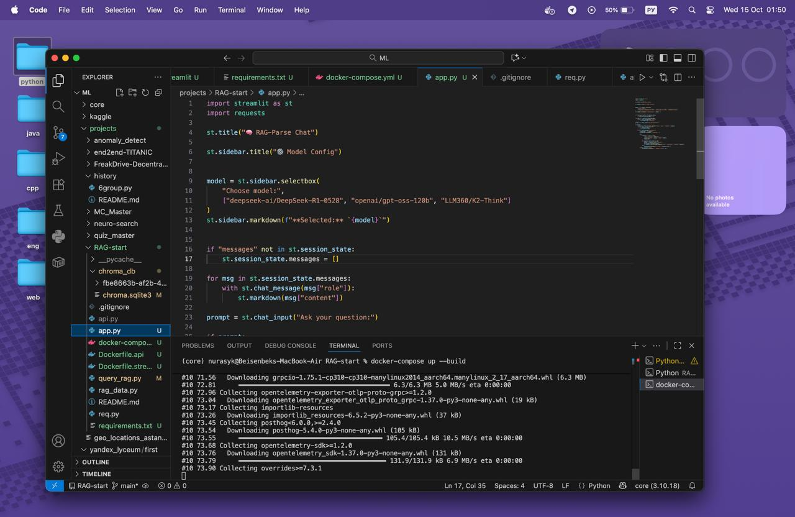
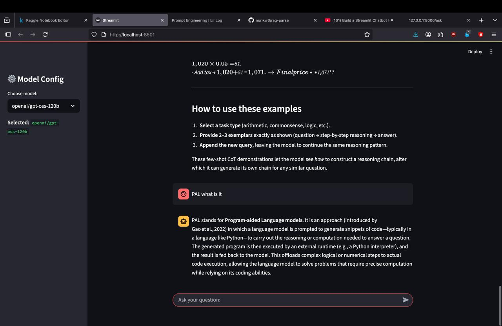

# 🧠 RAG-Parse Chat


A **Retrieval-Augmented Generation (RAG) system** for answering questions based on custom documents.  
Built with **LangChain**, **Chroma**, **BeautifulSoup**, **FastAPI**, **Streamlit**, and **Docker Compose**.  

---

## ✨ Features

- 💬 Interactive chat interface with **Streamlit**  
- 📚 Document retrieval using **LangChain + Chroma embeddings**  
- 🤖 Supports multiple LLM models: DeepSeek, OpenAI, K2-Think  
- ⚡ Backend powered by **FastAPI**  
- 🔒 Safe API key storage using **environment variables (.env)**  
- 🐳 Fully containerized with **Docker Compose**  

---

## 🖼 Screenshots

**Writing Code (`show.jpg`)**  


**Frontend (`app.jpg`)**  


---

## 🛠 Tech Stack

- Python 3.10  
- LangChain  
- Chroma (vector database)  
- BeautifulSoup (bs4)  
- FastAPI  
- Streamlit  
- Docker Compose  

---

## ⚙️ Setup

1. Clone the repository:

```bash
git clone <your-repo-url>
cd RAG-start
````

2. Create a `.env` file:

```env
LLM=your_api_token_here
```

> **Important:** Do not commit this file; add it to `.gitignore`.

3. Build and run with Docker Compose:

```bash
docker compose up --build
```

* 🌐 Frontend (Streamlit): [http://localhost:8501](http://localhost:8501)
* ⚡ Backend (FastAPI): [http://localhost:8000/docs](http://localhost:8000/docs)

---

## 📝 Usage

1. Open **Streamlit** in your browser
2. Select a model from the sidebar
3. Ask a question in the chat input
4. The system retrieves relevant documents and generates a response using the selected LLM

---

## 📂 Project Structure

```
RAG-start/
├─ api.py                 # API key helper
├─ streamlit_app.py       # Streamlit frontend
├─ query_rag.py           # FastAPI backend
├─ rag_data.py            # Embeddings & Chroma vector DB
├─ Dockerfile.api         # Backend Dockerfile
├─ Dockerfile.streamlit   # Frontend Dockerfile
├─ docker-compose.yml     # Docker Compose setup
├─ chroma_db/             # Persisted vector database
├─ show.jpg               # Screenshot of coding process
├─ app.jpg                # Screenshot of frontend
├─ requirements.txt       # Python dependencies
├─ .env                   # Environment variables (not in repo)
```

---

## 🔐 Security

* API keys are **never hardcoded**
* Use `.env` files and Docker environment variables

---

## 💡 Notes

* Works with multiple LLMs
* Fully containerized
* Designed for **rapid prototyping** and **RAG experimentation**
* Easy to share and deploy for collaborators

---

## 🚀 Contribution

Contributions are welcome! Please fork the repo, create a feature branch, and submit a pull request.

---

## 📫 Contact

Created by **@nurikw3 (tg)** – feel free to reach out for questions or collaborations.
